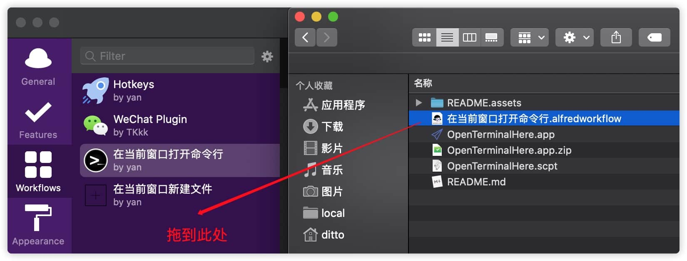
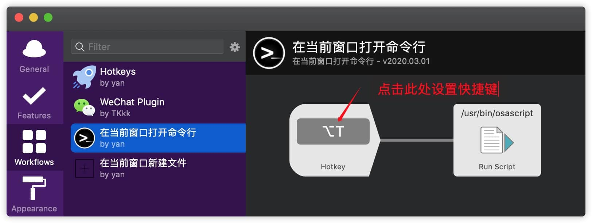
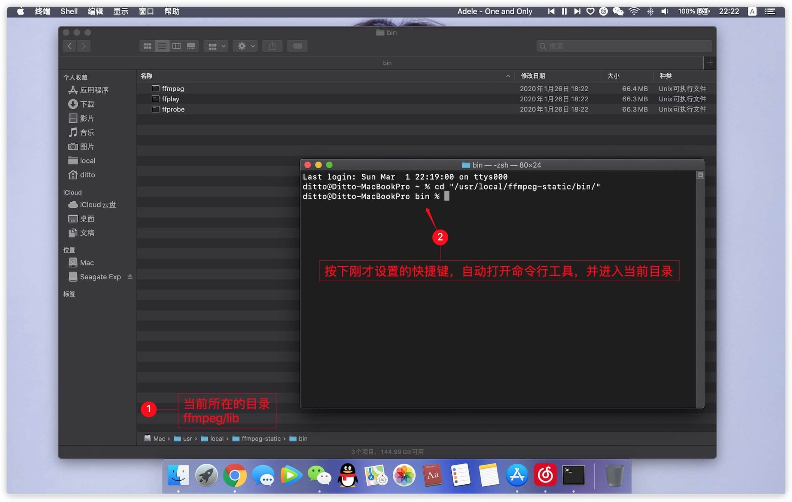

# 苹果 Mac 在当前目录打开命令窗口

Windows、Linux-Centos7等系统，都可以很方便的用鼠标右键在当前目录新建文件、打开命令窗口。

苹果 Mac OS 的[奥卡姆剃刀](https://baike.baidu.com/item/%E5%A5%A5%E5%8D%A1%E5%A7%86%E5%89%83%E5%88%80%E5%8E%9F%E7%90%86/10900565?fr=aladdin)设计，使得当前目录新建文件、打开命令行等操作非常繁琐。

(可参见：[苹果 Mac 在当前目录新建文件](https://github.com/yilsonyan/CreateNewFileiInFinder))

两种解决方案：1安装脚本软件，2安装 Alfred 脚本（推荐第二种）

## 第一种方案：

### 一、安装

- 步骤一：鼠标右键点击自定义工具栏

    

- 步骤二：安装脚本软件

    将本项目中的 OpenTerminalHere.app 拖动到工具栏位置

    

### 二、使用

在当前目录直接点击图标，将自动打开命令行工具，并进入当前目录

## 第二种方案：

### 一、安装

本方案使用 Alfred 脚本，Alfred 的 安装可参照：

> [MAC必备效率工具Alfred的介绍](https://www.jianshu.com/p/cf16b2c973e9)
>
> [MAC必备效率工具Alfred的一键式安装](https://www.jianshu.com/p/d21f8302f70f)

- 步骤一：拖动本项目中的 alfredworkflow 格式文件到 Alfred 工作流中

    

- 步骤二：设置快捷键

    

### 二、使用

在当前目录直接按下快捷键，将自动打开命令行工具，并进入当前目录

